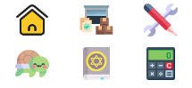
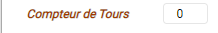

# WasmRP-Documentation

1. Accès à l'Application

Pour accéder à l'application, cliquez sur le lien suivant : https://blazorwasmrp.pages.dev

2. Sauvegarde / Chargement des Données

L'application fonctionne avec comme volume de donnée, un fichier JSON généré par l'application. Ce fichier a pour nom une succession d'informations comme ceci : Sauvegarde_Blai_24_06_2022 15_49_45.

Etant donné que fichier de sauvegarde a été téléchargé, il est possible de le modifier afin de faire correspondre des modificiations entre deux séances.

❌ **Attention** ❌

Vous pouvez certes modifier les données de votre personnnage mais il est recommandé d'effectuer les modifcations via l'application afin d'éviter les possibles perturbations du fichier et ainsi ne plus pouvoir charger votre personnage.

3. Modules

Dans l'application, il y a plusieurs sous-parties que j'appellerai les modules qui sont au nombre de 7.

- L'Affichage Général (Sidebar de Gauche) : 

Ce module permet d'avoir les statistiques générales du personnage affichées en permancance, de permettre la naviagation vers les différents modules restants, d'appliquer sur l'application le theme sombre ou encore de charger et sauvegarder toutes les données de votre personnage dans un fichier.

- L'Acceuil (Hub) : 

Ce module permet la modification des caractéristiques principales de votre personnage.

- L'Inventaire : 

Ce module permet la modification de l'inventaire de votre personnage ainsi que toutes les caractéristiques des items contenus dans cet inventaire.

- Les Compétences : 

Ce module permet de manager les compétences de votre personnage ainsi que de les utiliser (consommation de ressource définie à savoir aucune ressource, pv uniquement, pm uniquement, pv et pm)

- Les Familiers : 

Module à implémenter quand nous aurons une idée claire du systeme

- Les Affinités : 

Ce module est un affichage plus sympa de l'avancée de vos affinités

- Le Calcul de dégats : 

Ce module est fonctionnel mais il manque encore de quelques travaux pour qu'il puisse etre modulable et propre à chacun

4. Fonctionnalités des Modules

Cette partie est réservée à l'utilisation de chacun des modules. Nous allons donc réutiliser l'ordre de présentation pour ne pas vous perdre.

- L'Affichage Général (Sidebar de Gauche) : 
    *   Charger / Sauvegarder ses données :
            Cette action nécéssite deux clics, le premier sur le bouton "Charger / Sauvegarder" qui débloquera les deux options suivantes :
            
           
            
           
    *   Se déplacer dans les différents modules :
        
        

        Il suffit de cliquer sur l'un de ces boutons. Passer votre souris dessus vous indiquera vers quel module il vous emmenera.
    
    *   Appliquer le Dark Mode :

        

        Cliquer sur le bouton activera ou désactivera le Dark Mode.
    * Reset le Compteur de Tour :

        

        Il faut double-cliquer sur le texte pour reset le compteur.

- L'Acceuil (Hub) : Ce module permet la modification des caractéristiques principales de votre personnage.
- L'Inventaire : Ce module permet la modification de l'inventaire de votre personnage ainsi que toutes les caractéristiques des items contenus dans cet inventaire.
- Les Compétences : Ce module permet de manager les compétences de votre personnage ainsi que de les utiliser (consommation de ressource définie à savoir aucune ressource, pv uniquement, pm uniquement, pv et pm)
- Les Familiers : Module à implémenter quand nous aurons une idée claire du systeme
- Les Affinités : Ce module est un affichage plus sympa de l'avancée de vos affinités
- Le Calcul de dégats : Ce module est fonctionnel mais il manque encore de quelques travaux pour qu'il puisse etre modulable et propre à chacun

